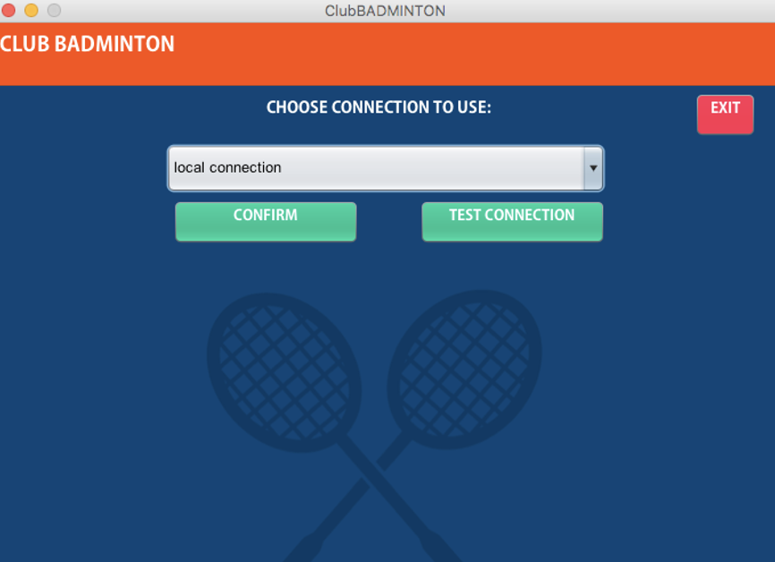
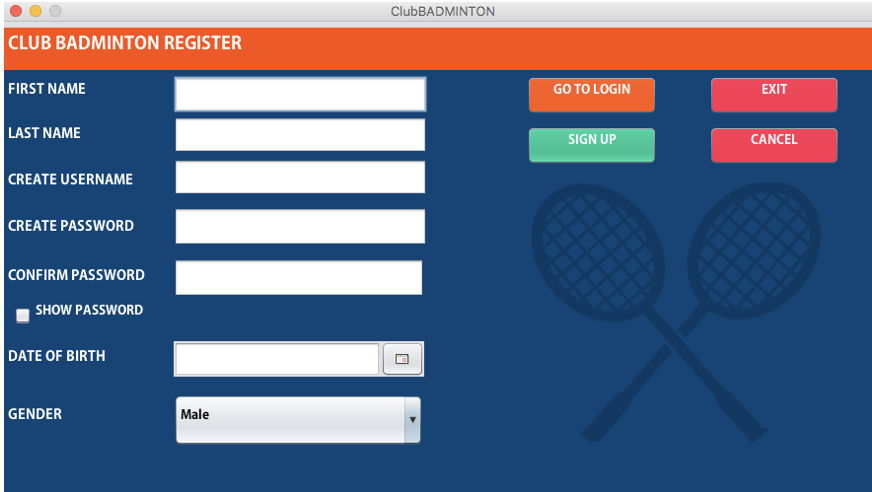
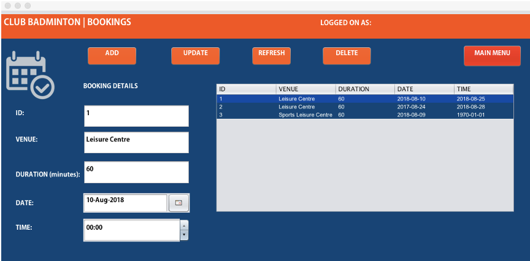
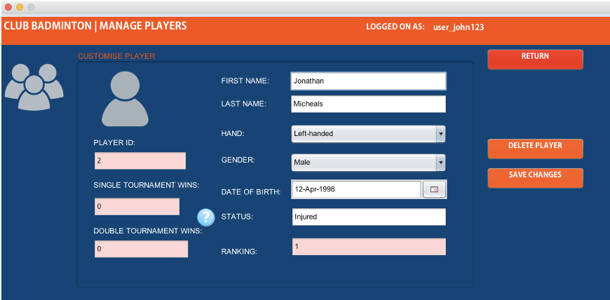
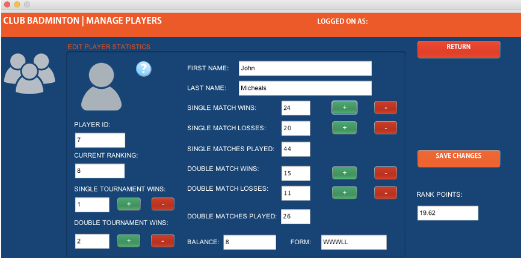
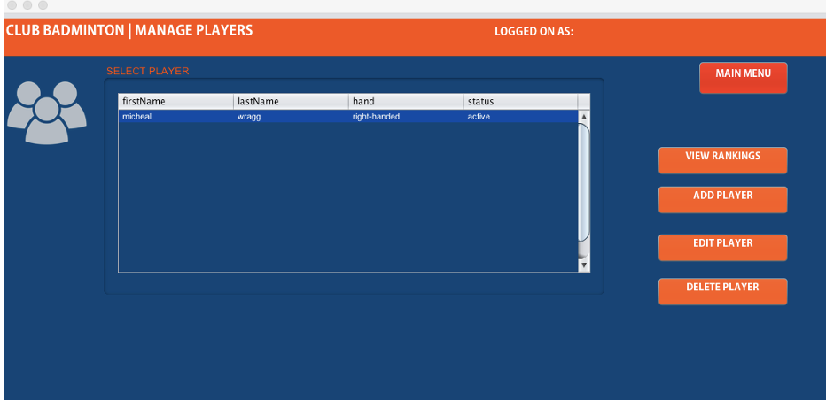
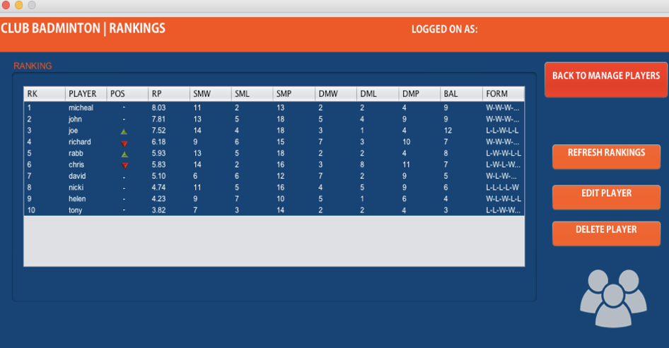
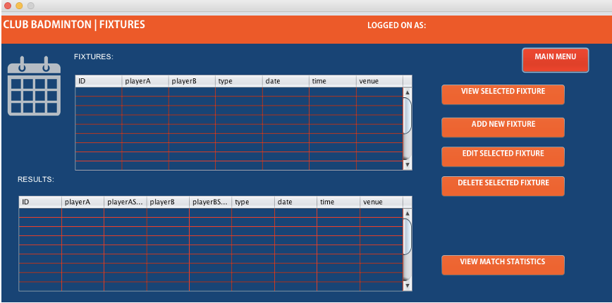
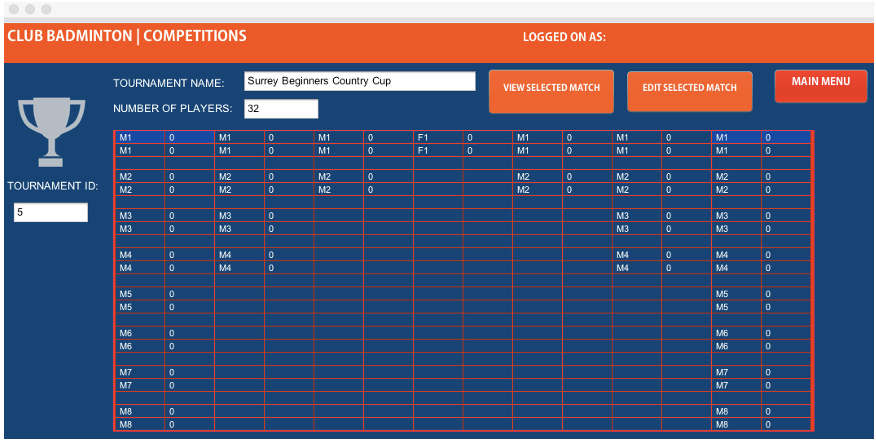

# BPMS ClubBadminton

This is a Java Netbeans project implemented in 2018 for a badminton player management system of a club of badminton players. The application of Netbeans and JavaFX was used to create the GUI for this project, while Java OOP programming was used for the code functionalities of the project. The application of MySQL was used for the database system of this project. The roles of the system include the administrator of the club and the users (which will be the players of the individual club).

Technology stack: Netbeans, Java, JavaFX, MySQL

# Features

Manage SQL Connection

Register as a new user:

Manage bookings:

Manage player profile (administration only):

Manage player statistics (administration only):

Manage players:

View rankings:

Manage fixtures:

Manage tournaments:
